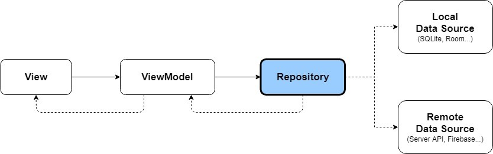

# Elice Mini Project

## 목표

- 엘리스 서비스의 일부를 구현
    - View 1. 추천 과목 및 무료 과목, 내 학습 리스트 (Home)
    - View 2. 과목 상세페이지 (Course Detail)

## Application Version

- minSdkVersion: 21
- targetSdkVersion: 34

## Packages

- data
    - repository, dao, model 등 전체적인 data 관련 file
- di
    - 의존성 주입 file
- extention
    - extention function file
- remote
    - API 호출에 필요한 관련 file
- util
    - project에 필요한 전반적인 추가 기능 file. ex) log 출력
- view
    - 화면에 관련된 file

## 구조



- view / viewModel / repositroy logic 분리
    - ex) 과목 상세페이지
        - view
            - view model data observe
            - view action 을 viewModel 로 전달
        - viewModel
            - 과목 상세 & 수업 list data를 repository를 통해 호출
            - view 에서 보여질 data 가공
            - view action 에 대한 data 처리
        - repository
            - local & remote data load


- koin library 를 이용한 DI 주입
    - room / remote / repository / viewModel Module 분리
        - room - local data 요청에 관련
        - remote - server 요청에 관련
        - reposotiry - data 요청에 관련
        - viewModel - viewModel 관련


- Base가 되는 class 활용
    - BaseActivity & BaseFragment
        - 해당 project 에서는 큰 활용이 없었으나 progressBar 과 같이 모든 activity & fragment 에서 공통으로 사용될 수 있는 view or function 활용 가능
    - BaseViewModel
        - launch function 을 만들어서 모든 viewModel에서 같은 방식으로 task 생성 & 관리
        ```
        abstract class BaseViewModel : ViewModel() {
            ...
            fun launch(
                jobName: String,
                childJob: suspend CoroutineScope.() -> Unit,
                endJob: suspend CoroutineScope.() -> Unit = {},
                exception: (Exception) -> Unit = {},
            )
            fun launch(
                childJob: suspend CoroutineScope.() -> Unit,
                endJob: suspend CoroutineScope.() -> Unit = {},
                exception: (Exception) -> Unit = {},
            )
        }
        ```
    - BasePagingSource
        - getRefreshKey & load override function 을 final 형태로 선언하여 모든 paging sourse 에 같은 방식으로 호출
        - 위 Class 를 상속받아 생성한 PagingSource 는 getNewData 를 통해 data load logic 만 구현하면 되도록
        ```
        abstract class BasePagingSource<Value : Any> (
            private val initPage: Int = 1,
        ) : PagingSource<Int, Value>() {
            final override fun getRefreshKey(state: PagingState<Int, Value>): Int {...}
            final override suspend fun load(params: LoadParams<Int>): LoadResult<Int, Value> {...}
            protected abstract suspend fun getNewData(page: Int, count: Int): PagingSourceData<Value>
        }
        ```
    - BasePagingAdapter & BaseListAdapter
        - onCreateViewHolder 을 final 형태로 선언하여 모든 adapter 에 같은 방식으로 호출
            - 크게 view type을 HEADER 와 그 이외로 구분하여 view holder 생성
        ```
        abstract class BasePagingAdapter<T : Any, VH : RecyclerView.ViewHolder>(diffCallback: DiffUtil.ItemCallback<T>) 
            :PagingDataAdapter<T, VH>(diffCallback) {
            final override fun onCreateViewHolder(parent: ViewGroup, viewType: Int): VH {...}
      
            abstract fun createHeaderViewHolder(parent: ViewGroup, viewType: Int): VH
            abstract fun createBodyViewHolder(parent: ViewGroup, viewType: Int): VH
        }
        ```
    - BaseViewHolder
        - onItemClick 은 기본적으로 viewHolder 에 전달된 data 를 전부 반환하는 기능이지만
        - 해당 project 에서는 커스텀이 없었지만 개별 viewHolder 에서 override 가능하여 커스텀 가능하도록 open 선언
        ```
        abstract class BaseViewHolder<VB : ViewDataBinding, T>(
            protected val binding: VB,
            private val itemClick: ((T) -> Unit) = {},
        ) : RecyclerView.ViewHolder(binding.root) {
            abstract fun display(item: T)
            open fun onItemClick(data: T) = this@BaseViewHolder.itemClick(data)
        }
        ```